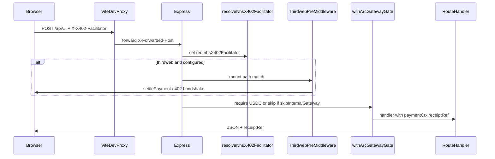

# Lovable MEGA handover — Clinical Arc subset (SNOMED + dm+d + NHS UK + CDR)

**Purpose:** Single markdown you can paste into **Lovable** (or any greenfield agent) to recreate a **working** HealthTech demo: **SNOMED intelligence** (local RF2 + optional paid **Featherless** concept summary + optional Snowstorm APIs), **NHSBSA dm+d intelligence**, **NHS UK data marketplace** (OpenGPT-style CSV lane), and **CDR (Confidential Data Rails)** — with **Arc Testnet USDC x402** (Circle Gateway and/or Thirdweb facilitator).

**Explicitly out of scope for the *product surface* (omit these pages from the hub and client router):**

- Neighbourhood health plan UI (`/nhs/neighbourhood-insights`)
- HES at scale UI (`/nhs/hes-scale`)

**Critical backend nuance:** The NHS UK marketplace **still calls** `POST /api/neighbourhood/uk/search` and `POST /api/neighbourhood/uk/synthesis`. Those routes live on the **same** `createNeighbourhoodRouter` as HES scale and insights. **Recommended approach for Lovable:** fork the reference repo (or copy files) and **trim only the React entry + hub links**; keep mounting `/api/neighbourhood` so you do not have to split the router on day one.

**Optional (not in the four showcase tiles):** **On-chain Runner (`/nhs/onchain-runner`, “x1 / x50”)** — dedicated Arc evidence page: **x1 smoke** (single gated trial) then a **sequential bulk run** whose size defaults to **50 attempts** (`batchSize` 10 × `batchCount` 5; both editable in UI, so “x50” is shorthand). Two modes: **`direct_onchain_transfer`** (MetaMask only, one `eth_sendTransaction` self-transfer per attempt → strict tx hash per row) and **`x402_circle_nanopayments`** (paid `POST` via `apiPost` to a selectable endpoint — reference defaults include **`/api/neighbourhood/scale/search`** and **`/api/neighbourhood/uk/search`**). Attempts in **`localStorage`** (`nhs_onchain_runner_attempts_v1`) with JSON export/import. Optional CLI: `npm run burst:hackathon` → `scripts/hackathon-burst.mjs` (QA, not the UI). Also optional: OpenEHR BFF (`/api/openehr/*`), full neighbourhood insights — omit unless you need them later.

---

## Section 1 — COPY-PASTE MEGA PROMPT (send this first)

```text
You are rebuilding a greenfield repo called "Clinical Arc subset" from specifications below.

GOAL
- React 19 + TypeScript + Vite 8 SPA, path-based routing (no React Router required): match paths exactly.
- Node 20+ Express 5 ESM API on port 8787.
- Vite dev server proxies /api and /openapi.json to 8787; preserve X-Forwarded-Host / X-Forwarded-Proto on proxy for Thirdweb x402 resource URLs.
- Arc Testnet (chain 5042002), USDC, x402: Circle Gateway batching via @circle-fin/x402-batching createGatewayMiddleware; optional Thirdweb settlePayment when X-X402-Facilitator: thirdweb and THIRDWEB_SECRET_KEY is set server-side.
- Four NHS UI surfaces ONLY:
  1) /nhs/snomed-intelligence — local RF2 browser: GET rf2 health/search/concept; optional paid POST /api/snomed/rf2/search, POST /api/snomed/rf2/concept, and POST /api/snomed/rf2/summary (Featherless LLM over loaded concept; needs FEATHERLESS_API_KEY); optional Snowstorm GET /api/snomed/health and /api/snomed/lookup/:id
  2) /nhs/dmd-intelligence — GET /api/dmd/health, GET /api/dmd/search; paid POST /api/dmd/lookup and /api/dmd/summary
  3) /nhs/uk-dataset-lane — paid POST /api/neighbourhood/uk/search and /api/neighbourhood/uk/synthesis (CSV datasets under data/)
  4) /nhs/cdr — CDR vault lifecycle + license check/issue + Pinata IPFS for file paths
- Hub /nhs (and /) lists ONLY those four + wallet instructions. REMOVE links to /nhs/neighbourhood-insights and /nhs/hes-scale.
- Shared shell: wallet connect, balances, Circle gateway deposit/balance, faucet link pattern, facilitator select where pages need it.
- Transaction log: use localStorage patterns from reference; filter per page (UK page currently uses listNhsTxHistoryHesScale which INCLUDES uk/search + uk/synthesis endpoints — keep or rename filter for clarity).

OPTIONAL FIFTH SURFACE — On-chain Runner (x1 / bulk “x50”)
- Path: /nhs/onchain-runner — component NhsTxRunnerApp.tsx; wire in main.tsx (pathname switch) like other NHS pages.
- UX label: “On-chain Runner (x1/x50)” — x1 = one smoke attempt; “x50” = default bulk of 50 sequential attempts after smoke passes (configurable batchSize × batchCount, default 10×5).
- Flow: user must Run x1 smoke successfully before bulk run is enabled. Bulk runs attempts 1..totalAttempts sequentially; stop button aborts mid-run.
- Modes: (1) direct_onchain_transfer — MetaMask wallet mode only; each attempt is a zero-value self-transfer on Arc testnet with a per-row tx hash when successful. (2) x402_circle_nanopayments — sets facilitator preference to circle; each attempt is apiPost(role, wallet, payload) to the selected paid API route; rows may show “Paid (x402)” without a per-row on-chain hash because Circle can batch settle (summary JSON explains chainTxCount vs auditOnlyCount).
- Paid targets (reference RUNNER_TARGETS): HES scale search POST /api/neighbourhood/scale/search; NHS UK lane search POST /api/neighbourhood/uk/search (payloads are small demo queries).
- Evidence: export attempts JSON; compare tx hashes with Arcscan for direct mode; for x402 mode document batching caveat in judge pack.
- Related npm script (optional headless burst): burst:hackathon → scripts/hackathon-burst.mjs

DO NOT IMPLEMENT AS PRODUCT PAGES
- /nhs/neighbourhood-insights
- /nhs/hes-scale

BACKEND MOUNTS (order matters)
1) express.json
2) resolveNhsX402Facilitator global middleware
3) If NHS_ENABLE_PAYMENT_GATE !== false AND THIRDWEB_SECRET_KEY set: mount Thirdweb payment middleware per prefix IN THIS ORDER: /api/neighbourhood, /api/openehr, /api/dmd, /api/snomed, /api/cdr
4) createNhsRouter on /api/nhs (if shell depends on it)
5) createNeighbourhoodRouter on /api/neighbourhood with { gateway, skipInternalGateway: req => req.nhsX402Facilitator==='thirdweb' }
6) Optionally createOpenehrBffRouter on /api/openehr (can no-op stub if removed from UI)
7) createSnomedRouter on /api/snomed with same deps
8) createDmdRouter on /api/dmd
9) createCdrRouter on /api/cdr
10) Circle helper routes used by shell: POST /api/circle/dev-wallet, /api/circle/sign-typed-data, /api/circle/gateway-deposit, /api/circle/gateway-balance
11) mountCircleModularProxy(app) if any client still posts /api/circle-modular
12) GET /openapi.json, GET /api/health, POST /api/arc/faucet

Dependencies (npm) must include at minimum:
react react-dom, vite @vitejs/plugin-react typescript,
express dotenv multer,
@circle-fin/x402-batching @circle-fin/developer-controlled-wallets,
@x402/core @x402/evm @x402/extensions @x402/fetch,
better-sqlite3, viem, thirdweb, ethers, buffer, concurrently

Deliverables: full source tree, .env.example mirroring matrix in handover doc, README quickstart, npm run dev:full works.

Reference implementation repository (clone for file-level truth): arunnadarasa/healtharcdemo (Agentic Hackathon Arc). Copy server modules verbatim where possible to reduce integration risk.
```

---

## Section 2 — Product routes (client)

| Path | Component | Purpose |
|------|-----------|---------|
| `/` or `/nhs` | Hub | Wallet + links to four demos only |
| `/nhs/snomed-intelligence` | SNOMED | RF2 + paid Featherless summary + optional Snowstorm |
| `/nhs/dmd-intelligence` | dm+d | wardle/dmd proxy + paid lookup/summary |
| `/nhs/uk-dataset-lane` | NHS UK marketplace | Paid CSV search + paid Featherless synthesis |
| `/nhs/cdr` | CDR | Vaults, Pinata, token policy / licenses |
| `/nhs/onchain-runner` | `NhsTxRunnerApp` (optional) | x1 smoke + sequential bulk (default 50); direct on-chain vs Circle x402 modes |

**Example trimmed `hubRoutes` / hub quick links (conceptual):**

```ts
// Core four:
/nhs/snomed-intelligence
/nhs/dmd-intelligence
/nhs/uk-dataset-lane
/nhs/cdr
// Optional fifth (hackathon / Arc tx evidence):
/nhs/onchain-runner   // label e.g. "On-chain runner (x1/x50)"
```

Reword hub hero: remove “Go to neighbourhood health plan” primary CTA; point users to SNOMED or dm+d first.

---

## Section 3 — Folder and file inventory (minimum copy set)

### Frontend (`src/`)

| Path | Role |
|------|------|
| `main.tsx` | Switch on `window.location.pathname` for hub + four pages (+ optional `/nhs/onchain-runner` → `NhsTxRunnerApp`) |
| `index.html`, `index.css`, `polyfills.ts` | Vite entry + globals (Buffer etc.) |
| `NhsHubApp.tsx` | Trimmed links/copy |
| `hubRoutes.ts` | Optional; trim groups to four routes |
| `NhsShell.tsx` | Wallet, balances, Circle gateway deposit/balance, faucet |
| `NhsSnomedIntelligenceApp.tsx` | SNOMED UI |
| `NhsDmdIntelligenceApp.tsx` | dm+d UI |
| `NhsUkDataMarketplaceApp.tsx` | UK lane UI |
| `NhsCdrApp.tsx` | CDR UI |
| `NhsTxRunnerApp.tsx` | Optional — On-chain Runner (x1 smoke, bulk x402 or direct txs) |
| `nhsSession.ts` | Role, wallet, network, auth headers |
| `nhsApi.ts`, `nhsArcPaidFetch.ts`, `arcX402Fetch.ts` | Paid POST + x402 + Thirdweb normalization |
| `nhsTxHistory.ts` | localStorage tx log + `paidDisplayForNeighbourhoodEndpoint` + list filters |
| `x402FacilitatorPreference.ts` | circle \| thirdweb preference |
| `arcGatewayBalance.ts`, `arcGatewayDeposit.ts`, `arcGatewayConstants.ts`, `arcWalletBalances.ts`, `arcChains.ts`, `evmWallet.ts` | As imported by `NhsShell` / apps |

**Omit for “four tiles only”:** `NhsNeighbourhoodInsightsApp.tsx`, `NhsHesScaleApp.tsx`, dance extras, GP access, etc. **Add back if you want the fifth surface:** `NhsTxRunnerApp.tsx` + `main.tsx` route for `/nhs/onchain-runner` + hub link (see `hubRoutes.ts` hint: “x1 smoke + sequential x50 strict tx-hash proof flow”).

### Backend (`server/`)

| Area | Files |
|------|--------|
| Core | `index.js` (large — extract mounts listed in mega prompt), `x402Env.js`, `x402FacilitatorContext.js`, `thirdwebX402.js`, `circleModularProxy.js` |
| Payment gate | `nhs/payment.js` (`withArcGatewayGate`) |
| NHS shell API | `nhs/router.js`, `nhs/auth.js`, `nhs/db.js` as required by `createNhsRouter` |
| SNOMED | `snomed/router.js`, `snomed/rf2LocalDb.js`, `snomed/snowstormClient.js` |
| dm+d | `dmd/router.js` |
| Neighbourhood (includes UK + HES + insights) | `neighbourhood/router.js`, `neighbourhood/nhsUkCsvSearch.js`, `neighbourhood/hesDb.js`, `neighbourhood/snomedContext.js` |
| OpenEHR (optional if mount kept) | `openehr/bffRouter.js` + clients as imported |
| CDR | `cdr/router.js`, `cdr/licenseContractAuth.js` |
| OpenAPI | `openapi.mjs` (optional but recommended) |

### Data (`data/`)

NHS UK CSV files **must exist** (names fixed in code):

| File | Dataset id |
|------|------------|
| `prepared_generated_data_for_nhs_uk_qa.csv` | `nhs_qa` |
| `prepared_generated_data_for_nhs_uk_conversations.csv` | `nhs_conversations` |
| `prepared_generated_data_for_medical_tasks.csv` | `medical_tasks` |

SNOMED RF2: SQLite DB default `data/snomed-rf2.db` (or override `SNOMED_RF2_SQLITE_PATH`); RF2 snapshot root via `SNOMED_RF2_BASE_DIR`.

---

## Section 4 — `package.json` scripts (full block)

Copy from the reference `package.json` `scripts` section:

```json
{
  "scripts": {
    "dev": "vite",
    "server": "node server/index.js",
    "dev:full": "concurrently \"npm run server\" \"npm run dev\"",
    "build:llm": "node scripts/build-llm-full.mjs",
    "smoke:nhs": "node scripts/nhs-smoke.mjs",
    "ingest:hes": "node scripts/ingest-artificial-hes.mjs",
    "hes:rebuild-fts": "node scripts/rebuild-hes-fts.mjs",
    "burst:hackathon": "node scripts/hackathon-burst.mjs",
    "snowstorm:up": "docker compose -f docker-compose.snowstorm.yml up -d",
    "snowstorm:down": "docker compose -f docker-compose.snowstorm.yml down",
    "snowstorm:poll-import": "node scripts/snowstorm-poll-import.mjs",
    "ehrbase:up": "docker compose -f docker-compose.ehrbase.yml up -d",
    "ehrbase:logs": "docker compose -f docker-compose.ehrbase.yml logs -f ehrbase",
    "evvm:vendor": "node scripts/install-evvm.mjs",
    "compile:contracts": "hardhat compile",
    "deploy:license:arc": "node scripts/deploy-license.ts",
    "seed:license:arc": "node scripts/seed-license.ts",
    "discovery": "npx -y @agentcash/discovery@latest discover \"http://localhost:8787\"",
    "build": "npm run build:llm && tsc -b && vite build",
    "lint": "eslint .",
    "preview": "vite preview"
  }
}
```

**Annotations for this subset:**

| Script | Needed? |
|--------|---------|
| `dev`, `server`, `dev:full` | **Yes** — primary dev |
| `build`, `preview` | **Yes** for production |
| `build:llm` | Optional — only if you ship `public/llm-full.txt` |
| `ingest:hes`, `hes:rebuild-fts` | **No** for UK+SNOMED+dm+d+CDR *unless* you still mount HES-backed neighbourhood routes and want real rows |
| `snowstorm:*` | Optional — SNOMED Snowstorm FHIR |
| `ehrbase:*` | Optional — omit if OpenEHR BFF not mounted |
| `compile:contracts`, `deploy:license:arc`, `seed:license:arc` | Optional — CDR **token** policy + on-chain license |
| `smoke:nhs`, `burst:hackathon`, `evvm:vendor`, `discovery` | Optional QA / extras |

## Section 5 — Environment variables matrix

| Variable | Required | Used by |
|----------|----------|---------|
| `PORT` | Optional (default 8787) | API |
| `ARC_TESTNET` | Optional | Server tone / docs |
| `NHS_ENABLE_PAYMENT_GATE` | Recommended (`true` for real x402, `false` to skip gate locally) | All gated POSTs |
| `X402_SELLER_ADDRESS` | **Yes** for paid flows | Circle x402 recipient |
| `X402_DECIMALS` | Optional | x402 env |
| `X402_FACILITATOR` | Optional (`circle` default) | Server default facilitator |
| `VITE_X402_FACILITATOR` | Optional | Browser default |
| `THIRDWEB_SECRET_KEY` | Required **if** using Thirdweb facilitator | Thirdweb settlement + `isThirdwebSettlementConfigured()` |
| `THIRDWEB_SERVER_WALLET_ADDRESS` | Optional | Thirdweb executor |
| `THIRDWEB_SETTLE_WAIT_UNTIL` | Optional | Thirdweb wait mode |
| `CIRCLE_API_KEY` / `CIRCLE_ENTITY_SECRET` | Optional | `POST /api/circle/dev-wallet` |
| `VITE_CIRCLE_CLIENT_KEY` | Optional | Only if UI loads Circle Modular SDK paths |
| `VITE_GATEWAY_*` | Optional | Auto top-up tuning |
| `DMD_SERVICE_URL` | **Yes** for dm+d (e.g. `http://localhost:8082`) | dm+d router upstream |
| `SNOMED_RF2_BASE_DIR` | **Yes** for local RF2 index | `rf2LocalDb.js` |
| `SNOMED_RF2_SQLITE_PATH` | Optional | RF2 SQLite path |
| `SNOWSTORM_URL` | Optional | Snowstorm FHIR |
| `FEATHERLESS_API_KEY` | **Yes** for `/api/neighbourhood/uk/synthesis`, dm+d **POST /summary**, and SNOMED **POST /api/snomed/rf2/summary** | LLM upstream |
| `FEATHERLESS_MODEL`, `FEATHERLESS_API_URL` | Optional | LLM |
| `PINATA_JWT` | **Yes** for CDR file/IPFS encrypt-store paths | `cdr/router.js` |
| `LICENSE_CONDITION_ADDRESS` | Optional | CDR token policy default contract |
| `VITE_DEFAULT_CDR_LICENSE_CONTRACT` | Optional | Browser default for token mode |
| `DEPLOYER_PRIVATE_KEY`, `ARC_RPC_URL` | Optional | `POST /api/cdr/licenses/issue` on-chain path |
| `EHRBASE_*` | Omit if OpenEHR not used | BFF |

Copy the full commented template from `.env.example` in the reference repo.

---

## Section 6 — HTTP API tables

### SNOMED — base path `/api/snomed`

| Method | Path | Paid | Notes |
|--------|------|------|--------|
| GET | `/health` | No | Snowstorm status |
| GET | `/lookup/:conceptId` | No | FHIR $lookup via Snowstorm |
| GET | `/rf2/health` | No | Local index readiness |
| GET | `/rf2/search?q=&limit=&offset=` | No | FTS search |
| POST | `/rf2/search` | Yes ($0.01) | Body `{ q, limit?, offset? }`; response `{ ok, receiptRef, ...rows }` |
| GET | `/rf2/concept/:conceptId` | No | Concept detail |
| POST | `/rf2/concept` | Yes ($0.01) | Body `{ conceptId }`; response `{ ok, receiptRef, ...concept }` |
| POST | `/rf2/summary` | Yes ($0.01) | Body `{ conceptId, network? }`; after x402 gate, server loads concept from RF2 DB and calls Featherless; requires `FEATHERLESS_API_KEY`; Thirdweb settle path includes `/rf2/summary` in `thirdwebX402.js` |

### dm+d — `/api/dmd`

| Method | Path | Paid | Notes |
|--------|------|------|--------|
| GET | `/health` | No | Upstream probe |
| GET | `/search` | No | Free search proxy |
| POST | `/lookup` | Yes | Body `{ q?, code? }` |
| POST | `/summary` | Yes | Needs `FEATHERLESS_API_KEY` |

### NHS UK — `/api/neighbourhood` (subset)

| Method | Path | Paid | Notes |
|--------|------|------|--------|
| POST | `/uk/search` | Yes | Body: `q`, `dataset`, `limit`, `offset`, `mode` |
| POST | `/uk/synthesis` | Yes | Body: `dataset`, `query`, `focus`, `audience`, `maxContextRows`; needs Featherless |

**Transaction log filter on UK page (reference implementation):** `listNhsTxHistoryHesScale` — misnamed “HesScale” but the underlying set includes **`/api/neighbourhood/uk/search`** and **`/api/neighbourhood/uk/synthesis`** so UK paid calls appear. SNOMED page uses `listNhsTxHistorySnomedRf2Search`, whose path set includes **`/api/snomed/rf2/search`**, **`/api/snomed/rf2/concept`**, and **`/api/snomed/rf2/summary`** (`src/nhsTxHistory.ts`).

### CDR — `/api/cdr`

| Method | Path | Paid | Notes |
|--------|------|------|--------|
| POST | `/licenses/check` | No | Token policy check |
| POST | `/licenses/issue` | No | May use `DEPLOYER_PRIVATE_KEY` + `ARC_RPC_URL` |
| POST | `/vaults/allocate` | Yes | |
| POST | `/vaults/:vaultId/encrypt-store` | Yes | Pinata when file upload |
| POST | `/vaults/:vaultId/request-access` | Yes | |
| POST | `/vaults/:vaultId/recover` | Yes | |
| POST | `/vaults/:vaultId/revoke` | Yes | |
| GET | `/vaults/:vaultId` | No | |
| GET | `/audit` | No | Optional `vaultId` query |

### Shell / infra (partial)

| Method | Path |
|--------|------|
| POST | `/api/circle/dev-wallet` |
| POST | `/api/circle/sign-typed-data` |
| POST | `/api/circle/gateway-deposit` |
| POST | `/api/circle/gateway-balance` |
| POST | `/api/circle-modular` | If mounted |
| GET | `/openapi.json` |
| POST | `/api/arc/faucet` |

---

## Section 7 — x402 flow (mermaid)



**Facilitator paths:** `server/x402FacilitatorContext.js` — `resolveNhsX402Facilitator` applies to `/api/neighbourhood`, `/api/openehr`, `/api/dmd`, `/api/cdr`, `/api/snomed`. `isPaidRoutedPost` must return true for paid POSTs including `/api/neighbourhood/uk/search`, `/api/neighbourhood/uk/synthesis`, `/api/snomed/rf2/search`, `/api/snomed/rf2/concept`, **`/api/snomed/rf2/summary`**, dm+d `/lookup`/`/summary`, CDR vault POSTs, etc.

---

## Section 8 — Bootstrap checklist

1. `git clone` reference repo **or** generate tree per Section 3.
2. `npm install` (Node 20+).
3. `cp .env.example .env` and fill **X402_SELLER_ADDRESS**, **DMD_SERVICE_URL**, **SNOMED_RF2_BASE_DIR**, **FEATHERLESS_API_KEY**, **PINATA_JWT** as needed.
4. Place the three **NHS UK** CSV files under `data/`.
5. Start RF2 index build (first run may return **503** on RF2 routes until `indexReady` on `/api/snomed/rf2/health`).
6. `npm run dev:full` → Vite **5173**, API **8787**.
7. **After pulling new API routes** (e.g. new paid POSTs such as `/api/snomed/rf2/summary`): restart `npm run server` or `npm run dev:full`. If an old Node process stays on **8787**, Express may return HTML **404** with `Cannot POST /path…` while older GET routes still work — the client maps that case to a “restart the API on 8787” hint (`src/nhsApi.ts` `errorFromResponse`).
8. Fund Arc testnet wallet (USDC + gas) — app links Circle faucet.
9. For Circle x402 batching: use in-app **Gateway deposit** when prompted (`NhsShell` paths above).
10. Optional: `THIRDWEB_SECRET_KEY` + set facilitator to Thirdweb in UI to exercise EIP-3009 path.

---

## Section 9 — Do NOT recreate (unless extending scope)

- Neighbourhood health plan page and OpenEHR live demos (unless you mount BFF).
- HES SQLite ingest / FTS scale page.
- On-chain runner — **omit** from the minimal four-tile Lovable build unless you need **x1 / ×50 Arc evidence**; if you need it, copy **`NhsTxRunnerApp.tsx`** + **`/nhs/onchain-runner`** route (see Section 1 optional block and `hubRoutes.ts`).
- Snowstorm: optional; Docker-heavy.

---

## Section 10 — Appendix

- **OpenAPI:** `GET http://localhost:8787/openapi.json` (also `GET /openapi.json` on same server).
- **Vite proxy:** mirror `vite.config.ts` `server.proxy` for `/api` and `/openapi.json`.
- **Regenerate LLM bundle:** `npm run build:llm` (optional).
- **Lovable static demo seeds (no TRUD blobs in git):** SNOMED concept list — `docs/LOVABLE_SNOMED_DEMO_CONCEPTS.{json,csv,md}`; dm+d search strings — `docs/LOVABLE_DMD_DEMO_ITEMS.{json,csv,md}`; NHS UK dataset lane — `docs/LOVABLE_NHS_UK_DATASET_LANE.{json,csv,md}` + mini CSV fixtures `docs/lovelyable-nhs-uk-fixtures/`.

---

*This handover was generated to match the **healtharcdemo** / Agentic Hackathon Arc tree at the time of writing. It includes **SNOMED POST `/api/snomed/rf2/summary`** (Featherless), **On-chain Runner (x1 / default ×50 bulk)** under `/nhs/onchain-runner` (`src/NhsTxRunnerApp.tsx`), plus operational notes for stale API processes on port 8787. When in doubt, diff against `server/index.js` mount order, `server/snomed/router.js`, `server/thirdwebX402.js`, and `server/x402FacilitatorContext.js`.*
